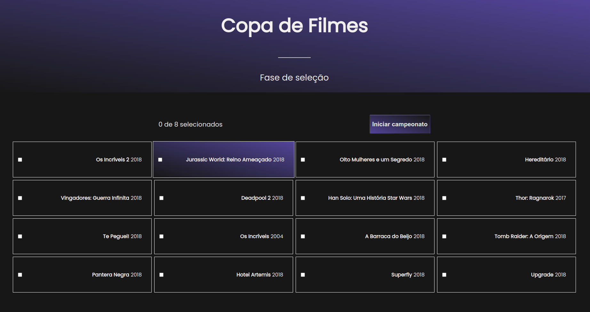

# Copa de filmes


<br>

Para fazer o clone do repositório digite o seguinte comando em seu terminal 

    
    git clone git@github.com:coutinhomarco/copa-de-filmes.git
    

Após realizar o clone do projeto, entre na pasta raiz do mesmo e digite 
```
npm install
```
ou
```
yarn install
```

<h2>Back End</h2>

<h3>.NET</h3>
<p>Tentei realizar a API via .NET, mas por ser meu primeiro contato com o mesmo tive bastante dificuldade e não acabei. Os arquivos da tentativa estão na pasta .NET na raiz do projeto</p>

<h3>Node.js</h3>
<p>Para não deixar em branco realizei o back end em Node.js, ferramenta que estou estudando no meu dia a dia. Os arquivos estão no caminho 

```
  ./src/back-end/node 
```
com referência na raiz do projeto</p>

Utilizei da biblioteca Express para realizar a construção da API.
As funções que utilizei para checar os vencedores estão na pasta
```
  ./src/helpers
```

<h3>Como iniciar:</h3>

Para iniciar o back-end basta executar o comando 
```
  npm run back
```
<h2>Front End</h2>

Tecnologias utilizadas

<ul>
  <li>React com componentes funcionais</li>
  <li>Context API e React Hooks para gerenciamento de estado</li>
  <li>React Router Dom para criação das rotas da Single Page Aplication</li>
  <li>Eslint para padronização do código</li>
</ul>

<h3>Como iniciar:</h3>
Inicie o back end com 

```
  npm run back
```

Para iniciar a aplicação execute

```
npm start
```


<h2>Testes</h2>

Para criar os testes do projeto utilizei da biblioteca Jest para o Back end e React testing Library para o Front.
Os testes da API e do Front estão respectivamente nas pastas
```
  ./src/back-end/node/node.test.js
  ./src/App.test.js
```
<h3>Como iniciar:</h3>

Inicie a API com 

```
  npm run back
```

Inicie o script React com
```
npm start
```
e agora é só rodar

  ```
    npm run jest //para testes do backend
    npm test //para testes do front
  ```

